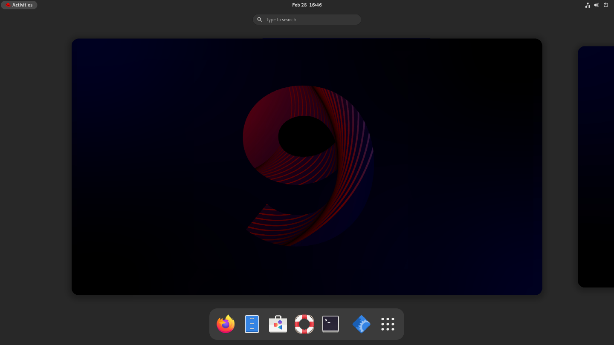
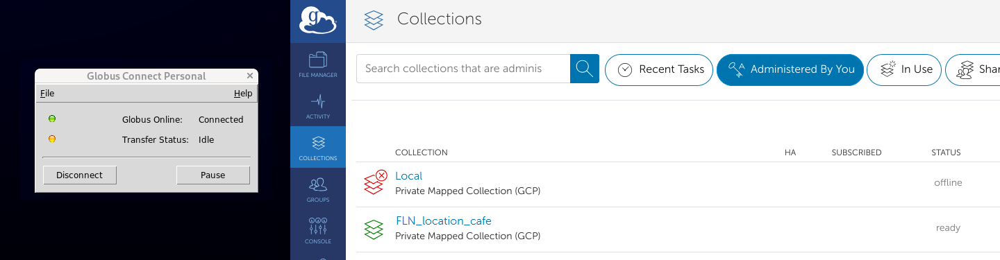
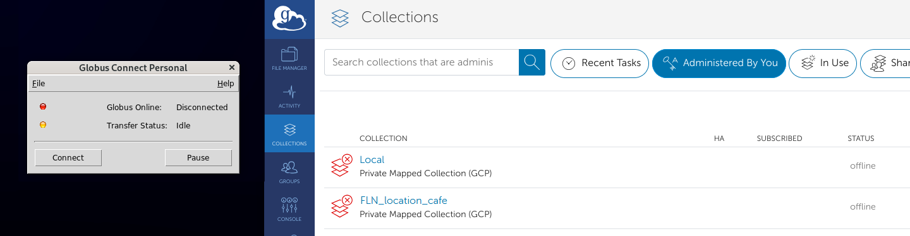

If you are at an ARS research facility with a SCINet-X connection, you have access to a SCINet cafe machine - a dedicated computer for high-speed data transfer to SCINet resources. <!--excerpt-->

## Getting Started

Using the café machines typically requires a LincPass.  If you have access to a café machine, but do not have a LincPass, contact the VRSC for assistance to use an alternative eAuth access method.

{: .usa-list }
1. **Log in to the machine using your SCINet username (first.last) and LincPass/PIN.**
  * The login screen should look like a typical desktop login.  If you see a terminal instead, contact the VRSC for assistance.
  * Machine may be slow after login, don’t worry about the extended black screen, it will eventually do something.
  * When you get the start screen you should see icons along the bottom for Firefox, files (cabinet) and terminal.  If you don’t see this, go to 'activities' in the upper left of the screen and it will toggle from the full window so you can access this dock.  
    

1. **Set up Globus Connect Personal (one time setup – done for each user)**
    1. Copy and paste the `wget` line into your terminal and hit enter.  
        
        {: .copy-code}
        ```
$ wget https://downloads.globus.org/globus-connect-personal/linux/stable/globusconnectpersonal-latest.tgz 
```
    1. After the download completes, type `ls` and you should see `globusconnectpersonal-latest.tgz`
    1. Next copy the `tar` line and paste and enter in the terminal window.  

        {: .copy-code}
        ```
$ tar xzf globusconnectpersonal-latest.tgz 
```
    1. `ls` should now show you `globusconnectpersonal-x.y.z`, where x.y.z is the version number.  
    1. Copy the `cd` line, replacing x.y.z with the version number.  Hit enter. 

        {: .copy-code}
        ```
$ cd globusconnectpersonal-x.y.z 
```
    1. Copy and paste the line below and hit enter. 
        
        {: .copy-code}
        ```
$ ./globusconnectpersonal 
```
    1. A globus login popup window will open.  
      * Select Log In.  
      * Go to the main Firefox window that opens behind the popup and select Allow.  
      * Select SCINET-ARS/USDA from the dropdown and complete the eAuth login. 
    1. **If you have used Globus before, select "link to" to join your globus account to this one.**  Otherwise, click continue.
      * You can also link accounts later using the steps on the [Globus linking account instructions.](https://docs.globus.org/guides/tutorials/manage-identities/link-to-existing/)
    1. When registering, type USDA-ARS as your organization and non-profit research – agree to terms and click continue. 
    1. Next page will ask you to agree to setup and asks for a name for future reference, keep the default – it should be the name of your SCINet café. Click allow. 
    1. Now you get a window for "Collection Details" – give it a name that will make sense to you.  For example:  your-initials and scinet-café (ABC_scinet_cafe).  Description is not necessary.  Do not select the "high assurance" button. Click save. 
    1. You should get a "setup successful" popup with the name of your collection. 
      * If you get a collection name that is generic like "scinet_cafe" you can click "show collection details" and, on the right of the collection details page, select "edit attributes" to edit the collection's  name.  
      * If you are happy with it, click "Exit Setup."   
    1. Your terminal window is now paused, and you don’t have a cursor.  In the terminal window, do Ctrl-C to get your cursor back. This will disconnect Globus for you.
    1. Type `cd ../` and then `ls`.  You should see the same list as before.  From the terminal window enter the following to delete the .tgz file OR from your Home on the desktop file system, you can drag the globusconnectpersonal-latest.tgz to the trash.   
        
        {: .copy-code}
        ```
$ rm -r globusconnectpersonal-latest.tgz 
```

## Transferring Data

**Please do not copy any files onto the café machine as it has limited hard drive space.** 

To move data from an external drive, connect the external drive you plan to use, and in the computer file system, hover over the drive name and see what "path name" you are shown (likely some variant of `/run/media/<firstname.lastname>/<drive_name>`). Using the path you found, back in the terminal type: 
```
$ echo "/run/media/<firstname.lastname>/<drive_name>,0,1" > .globusonline/lta/config-paths
```

### Using Globus Connect Personal.   

After Globus Connect Personal is set up, you can use the following command in the terminal to open the GCP connection interface and start the connection:

{: .copy-code }
```
$ ./globusconnectpersonal -start							 
```  

Once connected, you can use the window to connect or disconnect your session.  When you are finished transferring data, you can close the window or hit CTRL+C in the terminal to end your session.  

When you start the app and go to globus.org and login, you will be able to select your scinet-café collection, and you should see the files you have on that machine or external drive.  When you stop the app, it will no longer be accessible to you.  Please stop the app after each session. 





For more information on transferring data using Globus, see [Globus Data Transfer](/guides/data/transfer/globus#copying-data)