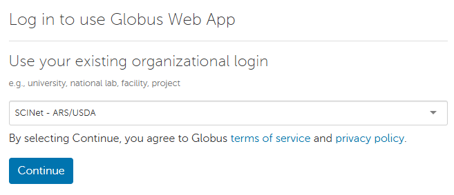
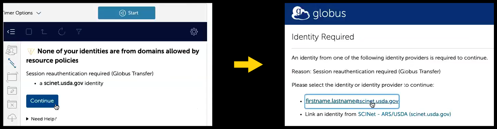
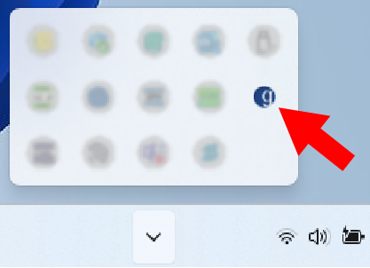

Globus is the recommended method for transferring data to, from, or among Ceres, Atlas, and Juno. It provides faster data transfer speeds compared to `scp`, has a graphical interface, and does not require authentication for every file transfer. To transfer data to or from a local computer, users will need to install Globus Connect Personal which does NOT require admin privileges. <!--excerpt-->

The [instructional video here](https://www.youtube.com/watch?v=BAodkpwOJuA) demonstrates how to transfer files using Globus as well as how to authenticate with LincPass or Login.gov.

## Login
1. In a browser, navigate to [https://www.globus.org/](https://www.globus.org/) and click "Log In" in the upper right corner.
1. Select "SCINet - ARS/USDA" in the existing organizational login dropdown menu to [use your SCINet credentials to log in](/guides/access/web-based-login).  
  
1. You should now be on the Globus "File Manager" page. You should see two panels. If you don't, click on the 2-panels icon at the top right of the screen. You should now see two panels:  
  

## Copying data
1. The two panels represent the two systems that you want to copy data between. You will need to select a Collection for each panel and possibly authenticate.
  * Click in the "Collection" box on one of the panels. A selection page will appear. Recent collections will be listed under the "Recent" tab. Click on the other tabs to see collections that you've bookmarked, created, or have been shared with you. In any of these tabs, you will also see the "Get Globus Connect Personal" button. See below for [how to set up Globus Connect Personal on your local computer](#globus-connect-personal) to transfer data to and from your local computer.
  * If you see your desired collection in the "Recent" tab, click it and continue. If you do not see your desired collection, start typing the name in the box at the top. When your collection appears, select it.
    * Type or select "SCINet-Ceres" for Ceres, "SCINet-Atlas" for Atlas, or "SCINet-Juno" for Juno.
    * If authentication is required for the selected collection, click "Continue" and then your SCINet-associated identity (i.e., scinet_username@scinet.usda.gov) to reauthenticate.
      
  * To transfer data between the Ceres and Atlas clusters, log in to SCINet-Ceres in one panel and to SCINet-Atlas in the other panel. Similarly, to transfer data to/from Juno, log into SCINet-Juno in one of the panels.
1. Once you have a selected a Collection on both panels, you will need to navigate to the files you want to copy in one panel (source panel) and navigate to the location to which you want them copied on the other panel (destination panel). You can either click on directory names or type the full path in the "Path" box (under the "Collection" box).
1. Before you start your copy, look at the "Transfer & Timer Options" near the top of the page between the two panels (click on the down arrow to see available options). To see a short description of each option, click on the "i" next to the option. Select any options applicable to your transfer. 
1. To start copying files, click the blue box with the arrow at the bottom of the page pointing in the direction of the destination pane.
1. You may now click "Activity" on the left-side menu to see a list of current and prior transfers. Click on "File Manager" at the top left of the page to get back to the main page.

## Globus Connect Personal

To transfer files to or from your local computer, you can use Globus Connect Personal (GCP).  

### Installation

* ***If you are on a SCINet-X location's café machine:**
  * Please see the [GCP setup instructions specific to café machines](/guides/data/transfer/cafe). 
* **If you are on a USDA-managed Windows laptop or workstation:**
  * If your workstation has CEC support, you may be able to install GCP directly from the Software Center.
* **If you are not on a USDA-managed laptop, do not have Software Center, or do not see GCP in the Software Center:**
  * A link "Get Globus Connect Personal" can be found in the Collection Search page (by clicking on the "Collection" box in the "File Manager"). 
  * The installation instructions for Globus Connect Personal are available here: 
    * [Windows Install Instructions](https://docs.globus.org/how-to/globus-connect-personal-windows/)
    * [Mac Install Instructions](https://docs.globus.org/how-to/globus-connect-personal-mac/)
    * [Linux Install Instructions](https://docs.globus.org/how-to/globus-connect-personal-linux/)

By default on Windows, GCP prompts to be installed in `C:\Program Files` which requires administrator rights. However, you don’t need administrator rights to install GCP on your local computer. If you do not have administrator rights, browse to a place to which you have write access (e.g., your Desktop folder) when prompted for an installation location. If you encounter further permission issues, contact your local IT staff for assistance. 

### Setup

1. Once GCP is installed, launch the application and a Globus Connect Personal Setup pop-up window will appear. Click "Log In".  
1. Go to the browser window that opens behind the pop-up and click "Allow".  
1. On the log in page, select "SCINet-ARS/USDA" from the dropdown menu, click "Continue", and complete the eAuth login procedure.  
  * If this is your first time authenticating Globus via your SCINet account, you will see a welcome page:
      * If you already have a Globus account with another authentication identity (e.g., via ORCID or a university), click "Link to an existing account" to join your SCINet-ARS/USDA Globus identity to your existing account. (You can also link identities later using the steps on the [Globus linking account instructions](https://docs.globus.org/guides/tutorials/manage-identities/link-to-existing/).)  
      * Otherwise, click "Continue" to register your SCINet account with a new Globus account. When registering, type "USDA-ARS" as your organization and select the "non-profit research or educational purposes" option. Agree to the terms and click "Continue".  
1. The next page will ask you to agree to set up GCP and ask for a name for this consent for future reference. You can keep the default value which should be the name of your local computer. Click "Allow".  
1. Now a pop-up window for "Collection Details" will appear. For "Collection Name", provide a unique name that will be recognizable to you as your local computer. For example:  your initials and "_workstation" (e.g., ABC_workstation). Providing a description is optional. Do not select the "High Assurance" checkbox (read about sensitive data on SCINet infrastructure [here]({{ site.baseurl }}/support/faq#can-i-store-sensitive-data-on-scinet-infrastructure)). Click "Save".  
1. You should get a "Setup Successful!" pop-up with the name of your collection.  
  * If you would like to modify your collection name, you can click "show collection details" and, on the right of the collection details page, click "edit attributes" to edit the collection's name.  
  * When you are happy with the collection name, click "Exit Setup". 

 
You can check the status of your GCP connection by clicking the GCP icon in your task bar.  
   

You can now transfer data from your local computer using [Globus.org](https://www.globus.org/) while Globus Connect Personal is running. You should find the GCP collection made above in your list of collections, and you will be able to connect to it while the local GCP connection is running on your local computer. After selecting your local computer collection, you should see in the Globus File Manager the files you have on that machine. See the [copying data](#copying-data) section for more information about copying data using Globus. 